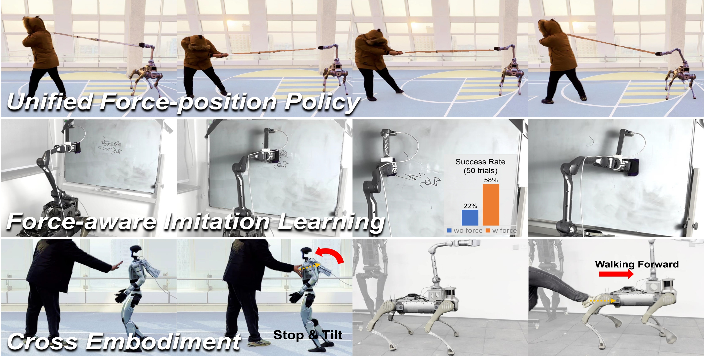

# UniFP - Unified Force and Position Control


<div align="center">
Conference on Robot Learning (CoRL) 2025 Best paper

[[Website]](https://unified-force.github.io/)
[[Arxiv]](https://arxiv.org/pdf/2505.20829)
[[Oral Talk]](https://youtu.be/9lzFVQoc4Do?t=2652)

<p align="center">
     &nbsp; &nbsp; &nbsp; &nbsp; &nbsp; &nbsp; &nbsp; &nbsp; &nbsp; &nbsp;
</p>

[](https://developer.nvidia.com/isaac-gym)
[](https://docs.python.org/3/whatsnew/3.8.html)
[](https://releases.ubuntu.com/20.04/)

</div>

## Overview

This project implements a reinforcement learning-based whole body control framework for B2Z1 robots, supporting unified policy learning for both position and force control. The framework uses Isaac Gym for simulation training and supports deployment from simulation to real robots.

**Key Features**:
- Support for B2Z1 robot whole body control
- Unified policy learning for position and force control
- Reinforcement learning training based on PPO algorithm
- Support for multiple robot configurations (B2Z1, G1, etc.)
- Complete simulation-to-real deployment pipeline

## TODO
- [x] Release UniFP training pipeline
- [ ] Release sim2real with ROS2
- [ ] Release sim2sim in MuJoCo
- [ ] Release imitation learing data collection pipeline

## Installation

### System Requirements
- Ubuntu 20.04/22.04
- Python 3.8
- CUDA 11.2+
- Isaac Gym Preview 4 (requires NVIDIA developer account)

### Installation Steps

1. **Clone this project**
   ```bash
   git clone https://github.com/deathpoker/UniFP.git
   cd UniFP
   ```

2. **Set up the environment**
   ```bash
   conda create -n unifp python=3.8 
   # isaacgym requires python <=3.8
   conda activate unifp
   # Download the Isaac Gym binaries from https://developer.nvidia.com/isaac-gym 
   wget https://developer.nvidia.com/isaac-gym-preview-4
   tar -xvzf isaac-gym-preview-4
   
   cd isaacgym/python && pip install -e .
   ```
    For libpython error:
    - Set LD_LIBRARY_PATH:
        ```bash
        export LD_LIBRARY_PATH=</path/to/conda/envs/your_env/lib>:$LD_LIBRARY_PATH
        ```

3. **Install Python dependencies**
   ```bash
   # Install PyTorch
   conda install pytorch==2.3.1 torchvision==0.18.1 torchaudio==2.3.1 pytorch-cuda=12.1 -c pytorch -c nvidia
   
   # Install other dependencies
   pip install numpy matplotlib wandb
   ```


## Usage

### Policy Training

#### B2Z1 Position-Force Control Training
```bash
cd legged_gym/scripts
python train_b2z1posforce.py --task=b2z1_pos_force --headless
```

### Policy Evaluation and Testing

#### Run Trained Policies
```bash
# B2Z1 position-force control testing
python play_b2z1posforce.py --task=b2z1_pos_force --load_run=<run_name>
```

### Parameter Configuration

#### Training Parameters
- `--task`: Task name (b2z1_pos_force, b2z1_force_realrobot, h1, g1_humanoidgym, etc.)
- `--headless`: Run in headless mode
- `--num_envs`: Number of parallel environments
- `--max_iterations`: Maximum training iterations

#### Environment Parameters
- `--flat_terrain`: Use flat terrain
- `--physics_engine`: Physics engine (physx)
- `--sim_device`: Simulation device (cuda:0)


### Core Components

- **Environment Configuration** (`legged_gym/envs/b2/b2z1_pos_force_config.py`)
  - Robot initial state configuration
  - Reward function parameters
  - Observation space definition
  - Action space definition

- **Environment Implementation** (`legged_gym/envs/b2/legged_robot_b2z1_pos_force.py`)
  - Simulation environment logic
  - Reward calculation
  - Observation space construction
  - Action execution

- **Training Algorithm** (`legged_gym/b2_gym_learn/ppo_cse_pf/`)
  - PPO algorithm implementation
  - Policy network structure
  - Value network structure

- **Task Registration** (`legged_gym/utils/task_registry_b2z1posforce.py`)
  - Task registration management
  - Environment creation
  - Trainer creation

